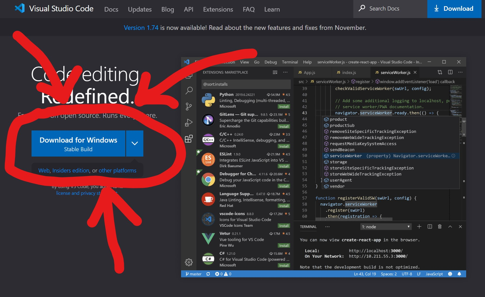

# Instructions for CSE 15L Remote Access 
It isn't that bad. Sorta.
## Step 1 - Visual Code Studio <3
With our favorite IDE, we can do the remote access stuff. First you need to download this lovely, 
totally not a fake program to phish your information, program [here](https://code.visualstudio.com/).

If you already have it, you can still re-download for whatever reason or just chill. 

If you are unsure, this be what the install button look like

