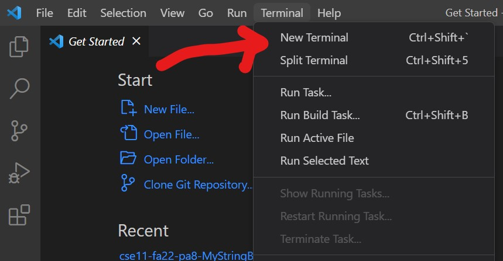

# Instructions for CSE 15L Remote Access 
It isn't that bad. Sorta. 

This blog describes instruction for remote access for ieng6.
## Step 1 - Visual Code Studio <3
With our favorite IDE, we can do the remote access stuff. First you need to download this lovely, 
totally not a fake program to phish your information, program [here](https://code.visualstudio.com/).
Make sure to download the version that works with your OS, or if you are doing some wacky virtual 
machine stuff like running windows on a mac, I get a feeling you already know what you are doing. 

If you already have it, you can still re-download for whatever reason or just chill. 

If you are unsure, this be what the install button look like

## Step 2 - Remotely Connecting (You'll hate this or not)

Look. You know that thing that professor said to find your course-specific account and stuff?

You ***have*** to reset your password for this part to work. I know, it's wack, but do it. Also 
write down the password or something since your password manager probably doesn't work with V-Studio. 

Anyways, the lab report instructions didn't say to explain Git so I'm assuming you got downloaded. 
If not, Git is some sort of program that adds a git bash terminal to V-Studio. Good luck googling 
or asking your professor, but moving on.

You wanna open a new terminal located somewhere on top of the screen. Click Terminal and it should 
open a drop dox for the contents. From there, hit these keys to open up a magical menu to set something 
to Git Bash.

* Ctrl + Shift + P

Search "Select Default Profile" and choose Git Bash then wait like a minute for it to load.

Click the Plus sign to add a new terminal, using the arrow to specifically choose bash. 

It actually doesn't matter if you use powershell or bash at this point. Then, type "ssh cs15lwi23zz@ieng6.ucsd.edu" 
except with your credentials to login. From there, it'll ask you for a password **and** it will not show your password as you 
type or any indication you typed something. Just blindly type your resetted password and you should be able to login.
 
# Step 3 - Trying Some Commands (omg this is where pwd works)

Now you're in the terminal, connected to the other computer, you can now do the stuff the professor been describing :D

That is assuming you were paying attention...

Anyways, here is a refresher on some commands you can try!

* ls - list stuff vaguely
* pwd - check current directory 
* .. - go backword in folders
* cd <path> - go to somewhere using relative or ~/ absolute paths
  
 You probably should refer to notes for more commands.
