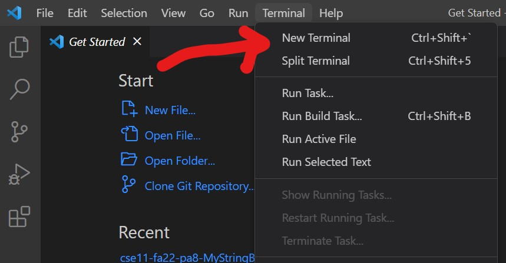

# Lab 2-3, The Server and others
Okay, it's sorta bad. 

This blog describes instruction for basic usage of the Server and URL Handler class in java
## Part 1 - The String Server
For this lab report, you were required to make a webpage that can add and display messages by URL. 
Of course, tho, you were surely uneducated and unfamilar with the code so you took a bit to understand 
and add comments to understand every part of the code. 

Below is an image of the StringsServer code and comments for many lines explaining the purpose of each. There are also 
some imports required for the code to functiona as well as the provided message that handles the server startup. 

Here is an example of the webpage after one run of the URL. 

The methods that are being called by the example is the .getPath() in order to retrieve the path of "/add-message," a 
.equals to check if the path matches "/add-message," and .getQuery() with .split("=") in order to copy down the url information 
that exist between ? and = as the first element in String array parameter and the information that exist between = and the end of 
the URL for the second element in parameter. 

The code then check these elements in the String array if the first is "s" before adding the second element as part of the single 
string called messages. The code also adds a "\n" for formatting the string for the next entry. The code then returns the messages 
string to be displayed on the webpage. The information passed into the URL is "example message first" or with the spaces replaced 
with %20.

This is the second example when another message is added after the first. It is displayed in a new line to distinct it as a new 
entry to the string messages of the code. The code does the same as the first, checking the URL information before copying 
down the information into a String array to be then added to the messages string that is returned to be displayed. Here, the 
string that is passed to the code is "the following second message" or "the%20following%20second%20message" in the URL.

## Part 2 - Remotely Connecting (You'll hate this or not)

Look. You know that thing that professor said to find your course-specific account and stuff?

You ***have*** to reset your password for this part to work. I know, it's wack, but do it. Also 
write down the password or something since your password manager probably doesn't work with V-Studio. 

Anyways, the lab report instructions didn't say to explain Git so I'm assuming you got downloaded. 
If not, Git is some sort of program that adds a git bash terminal to V-Studio. Good luck googling 
or asking your professor, but moving on.

You wanna open a new terminal located somewhere on top of the screen. Click Terminal and it should 
open a drop dox for the contents. From there, hit these keys to open up a magical menu to set something 
to Git Bash.

    Ctrl + Shift + P

Search "Select Default Profile" and choose Git Bash then wait like a minute for it to load.

Click the Plus sign to add a new terminal, using the arrow to specifically choose bash. 

It actually doesn't matter if you use powershell or bash at this point. Then, type "ssh cs15lwi23zz@ieng6.ucsd.edu" 
except with your credentials to login. From there, it'll ask you for a password **and** it will not show your password as you 
type or any indication you typed something. Just blindly type your resetted password and you should be able to login.

 
# Step 3 - Trying Some Commands (omg this is where pwd works)

Now you're in the terminal, connected to the other computer, you can now do the stuff the professor been describing :D

That is assuming you were paying attention...

Anyways, here is a refresher on some commands you can try!

* ls - list the files and folders in the current working directory 
* pwd - check where is the current directory currently located at 
* .. - go backword in the directory to the previous folder and can be combined with cd ..<path> for more complicated movement
* cd <path> - go to specified directory using relative or ~/ absolute paths. note that root directories are treated differently
  
Refer to online notes for more commands.
 
 

 Example of pwd. Also use exit or ctrl + D to logout and end session.
